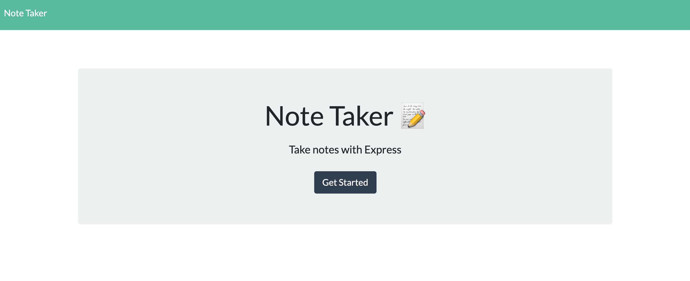
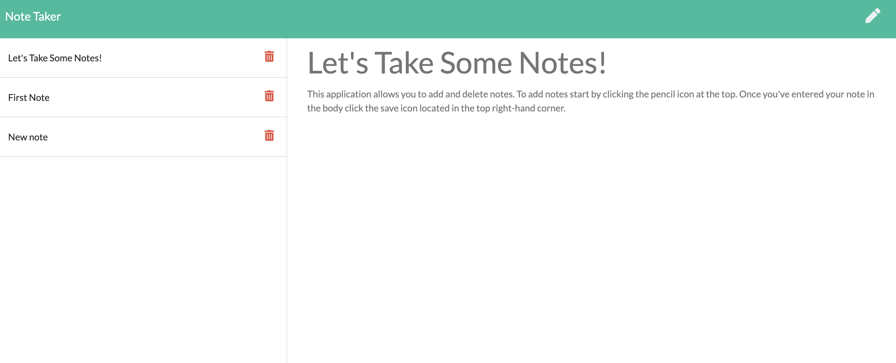

# Note Taker 


## Description 
An application that provides the user the ability to add new notes, and to delete notes. 

## Table of Contents
* [Installation](#installation)
* [User Story](#user-story)
* [Acceptance Criteria](#acceptance-criteria)
* [Usage](#usage)
* [Links](#links)
* [Screenshots](#screenshots)


## Installation 

Clone the repository from GitHub and download Node. The user then needs to install Express.js.
 
## User Story

```md
AS A small business owner
I WANT to be able to write and save notes
SO THAT I can organize my thoughts and keep track of tasks I need to complete
```

## Acceptance Criteria

```md
GIVEN a note-taking application
WHEN I open the Note Taker
THEN I am presented with a landing page with a link to a notes page
WHEN I click on the link to the notes page
THEN I am presented with a page with existing notes listed in the left-hand column, plus empty fields to enter a new note title and the note’s text in the right-hand column
WHEN I enter a new note title and the note’s text
THEN a Save icon appears in the navigation at the top of the page
WHEN I click on the Save icon
THEN the new note I have entered is saved and appears in the left-hand column with the other existing notes
WHEN I click on an existing note in the list in the left-hand column
THEN that note appears in the right-hand column
WHEN I click on the Write icon in the navigation at the top of the page
THEN I am presented with empty fields to enter a new note title and the note’s text in the right-hand column
```

## Usage
To  create new notes in the right-hand column while being able to delete them from the left-hand column.


## Links
<p>To View the Live Application: <a href="https://nameless-mountain-77177.herokuapp.com/"> Click Here</a></p>


## Screenshots
<br>
<br>


